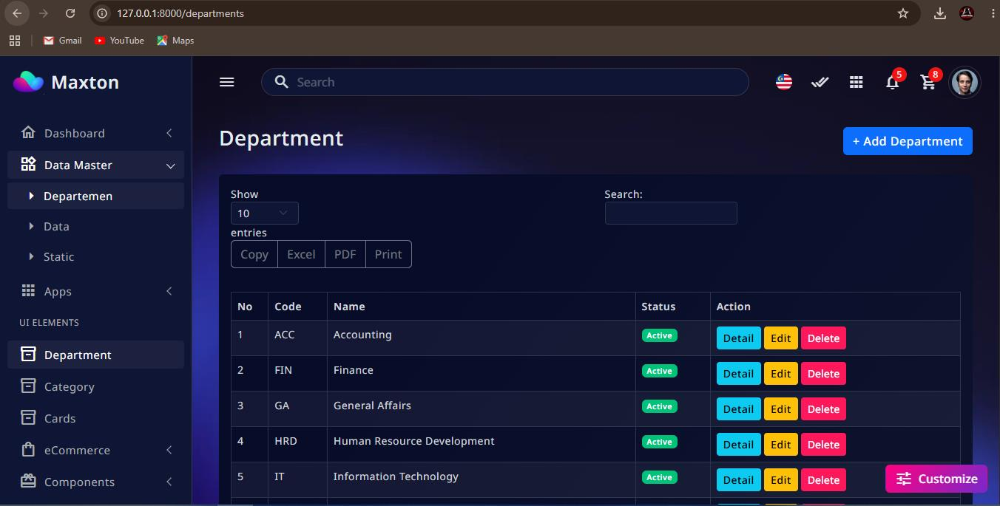
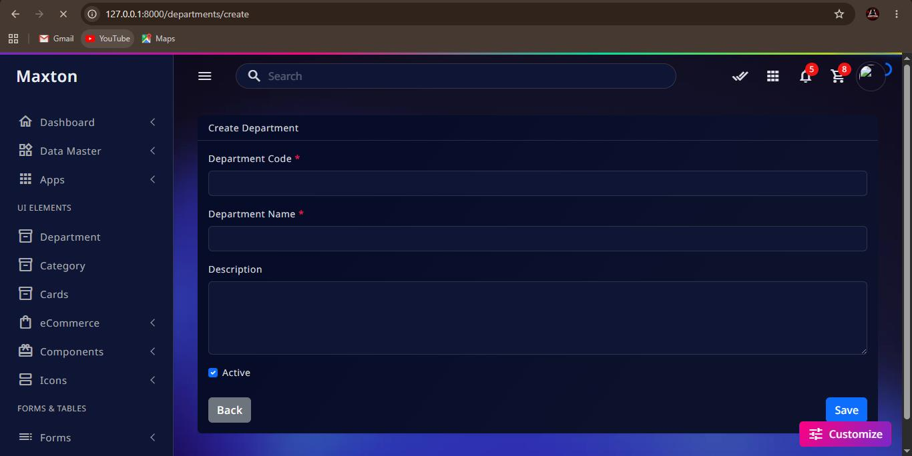
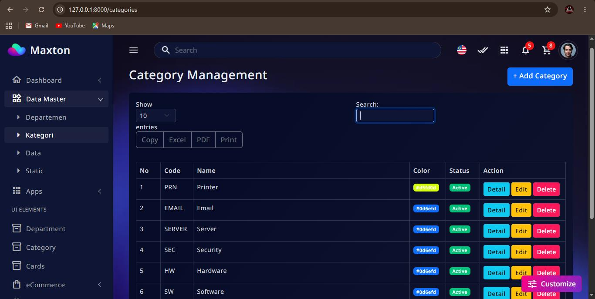
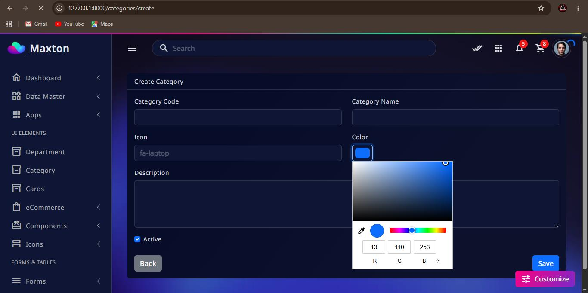
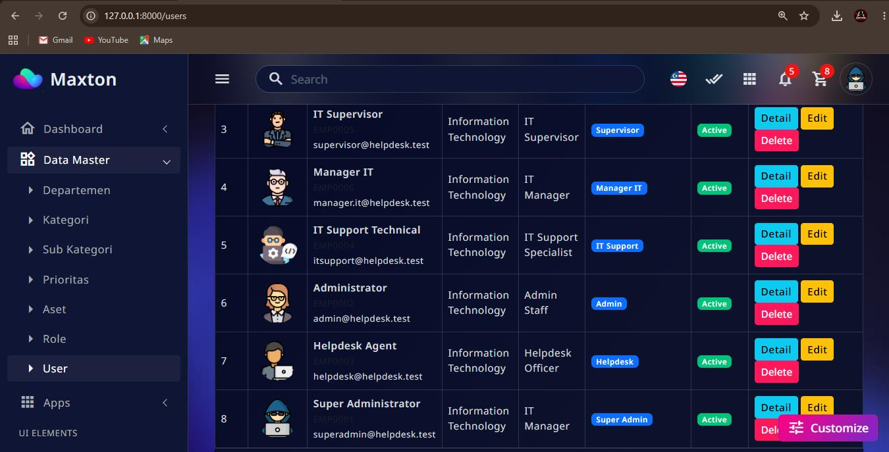
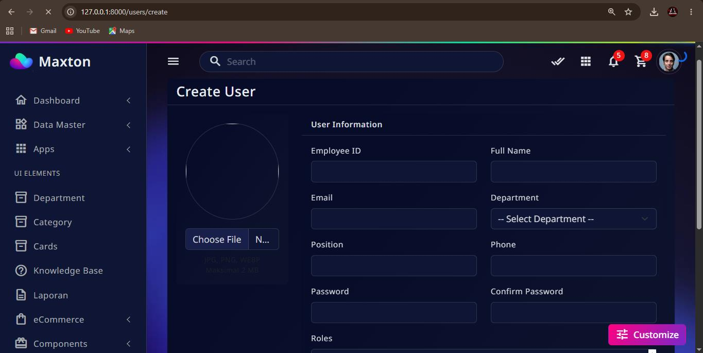

<p align="center">
  <a href="https://www.php.net/">
    
  </a>
  <a href="https://laravel.com/">
    
  </a>
  <a href="https://getbootstrap.com/">
    
  </a>
  <a href="https://www.mysql.com/">
    
  </a>
  <a href="https://tailwindcss.com/">
    
  </a>
  <a href="https://vite.dev/">
    
  </a>
</p>

<p align="center">
  
  
  
  
</p>


## About NovaDesk

# NovaDesk IT Ticketing System


**NovaDesk IT Ticketing System** adalah aplikasi manajemen tiket IT berbasis web yang dirancang untuk membantu tim IT dalam menerima, mengelola, memantau, dan menyelesaikan berbagai permintaan maupun permasalahan teknis dari pengguna.

NovaDesk dibangun menggunakan **PHP 8.2**, **Laravel 12**, **Tailwind CSS**, **Bootstrap 5**, dan **Maxton Admin Template** dengan **Vite** sebagai asset bundler.

---

## ✨ Features

* 🎫 **IT Ticket Management**

  * Membuat tiket baru
  * Melihat detail tiket
  * Mengubah status tiket
  * Menentukan prioritas tiket
  * Menentukan kategori tiket
  * Menugaskan tiket kepada teknisi

* 👥 **User Management**

  * Manajemen pengguna
  * Role dan permission
  * Informasi pengguna

* 🛠️ **IT Support**

  * Assignment teknisi
  * Tracking progress tiket
  * Riwayat aktivitas tiket
  * Penyelesaian tiket

* 📊 **Dashboard**

  * Total tiket
  * Open tickets
  * Pending tickets
  * In progress tickets
  * Resolved tickets
  * Statistik tiket

* 🔔 **Ticket Tracking**

  * Status tiket
  * Prioritas
  * Kategori
  * Teknisi yang menangani
  * Waktu pembuatan dan penyelesaian

* 🎨 **Modern Admin Interface**

  * Maxton Admin Template
  * Bootstrap 5
  * Tailwind CSS
  * Responsive layout
  * Modern dashboard

---

## 📸 Screenshots

Screenshot project disimpan di:

```text
docs/
└── images/
    ├── dashboard.png
    ├── login.png
    ├── tickets.png
    ├── ticket-detail.png
    ├── create-ticket.png
    ├── users.png
    └── settings.png
```

### Dashboard


Dashboard utama menampilkan ringkasan kondisi sistem ticketing, termasuk jumlah tiket berdasarkan status, prioritas, dan informasi operasional lainnya.

### Login


Halaman login digunakan untuk autentikasi pengguna sebelum mengakses sistem NovaDesk.

### Ticket Management


Halaman ticket management digunakan untuk melihat dan mengelola seluruh tiket IT yang masuk ke dalam sistem.

### Ticket Detail


Halaman detail tiket menampilkan informasi lengkap mengenai tiket, status, prioritas, kategori, teknisi, serta riwayat aktivitas.

### Create Ticket


Form pembuatan tiket digunakan oleh pengguna untuk melaporkan masalah atau membuat permintaan bantuan kepada tim IT.

### User Management


Halaman user management digunakan untuk mengelola pengguna yang memiliki akses ke sistem.

### Settings


Halaman settings digunakan untuk mengatur konfigurasi aplikasi.

---

## 🧰 Technology Stack

| Technology   | Version                 |
| ------------ | ----------------------- |
| PHP          | 8.2+                    |
| Laravel      | 12                      |
| Tailwind CSS | Latest / Project Config |
| Bootstrap    | 5                       |
| Maxton       | Admin Template          |
| Node.js      | 18+ recommended         |
| NPM          | Latest                  |
| Vite         | Project Dependency      |
| MySQL        | 8+ recommended          |

### Backend

* PHP 8.2
* Laravel 12
* Laravel Eloquent ORM
* Laravel Blade

### Frontend

* Tailwind CSS
* Bootstrap 5
* Maxton Admin Template
* JavaScript
* Vite
* NPM

### Database

NovaDesk dapat menggunakan database relational seperti:

* MySQL
* MariaDB

---

## 📋 Requirements

Pastikan environment development telah memiliki:

* PHP >= 8.2
* Composer
* Node.js
* NPM
* MySQL / MariaDB
* Git

Untuk memeriksa versi PHP:

```bash
php -v
```

Memeriksa Composer:

```bash
composer -V
```

Memeriksa Node.js:

```bash
node -v
```

Memeriksa NPM:

```bash
npm -v
```

---

## 🚀 Installation

### 1. Clone Repository

```bash
git clone https://github.com/your-username/novadesk.git
```

Masuk ke directory project:

```bash
cd novadesk
```

---

### 2. Install PHP Dependencies

Install dependency Laravel menggunakan Composer:

```bash
composer install
```

---

### 3. Install Node Dependencies

Install dependency frontend:

```bash
npm install
```

---

### 4. Environment Configuration

Copy file `.env.example` menjadi `.env`:

```bash
cp .env.example .env
```

Untuk Windows:

```powershell
copy .env.example .env
```

Kemudian generate application key:

```bash
php artisan key:generate
```

---

## 🗄️ Database Configuration

Buat database baru, misalnya:

```text
novadesk
```

Kemudian konfigurasi file `.env`:

```env
APP_NAME=NovaDesk
APP_ENV=local
APP_KEY=
APP_DEBUG=true
APP_URL=http://localhost

DB_CONNECTION=mysql
DB_HOST=127.0.0.1
DB_PORT=3306
DB_DATABASE=novadesk
DB_USERNAME=root
DB_PASSWORD=
```

Sesuaikan `DB_USERNAME` dan `DB_PASSWORD` dengan konfigurasi database lokal.

---

## 🔄 Database Migration

Jalankan migration:

```bash
php artisan migrate
```

Jika project menyediakan database seeder:

```bash
php artisan db:seed
```

Atau jalankan migration dan seeder sekaligus:

```bash
php artisan migrate --seed
```

---

## 🔗 Storage Link

Jika aplikasi menggunakan file attachment atau upload file, jalankan:

```bash
php artisan storage:link
```

---

## 🎨 Frontend Assets

NovaDesk menggunakan **Vite** untuk proses build asset frontend.

### Development

Untuk menjalankan Vite dalam mode development:

```bash
npm run dev
```

Kemudian jalankan Laravel:

```bash
php artisan serve
```

Aplikasi dapat diakses melalui:

```text
http://127.0.0.1:8000
```

---

## 📦 Production Build

Untuk membuat production build:

```bash
npm run build
```

Vite akan melakukan compile dan optimasi asset frontend ke dalam directory:

```text
public/build/
```

Untuk deployment production, pastikan menjalankan:

```bash
composer install --optimize-autoloader --no-dev
npm install
npm run build
php artisan config:cache
php artisan route:cache
php artisan view:cache
```

---

## 🧹 Laravel Cache

Jika mengalami masalah konfigurasi atau asset, bersihkan cache Laravel:

```bash
php artisan optimize:clear
```

Kemudian jalankan kembali:

```bash
npm run build
```

---

## ▶️ Running Application

Untuk menjalankan aplikasi pada environment development:

### Terminal 1

```bash
php artisan serve
```

### Terminal 2

```bash
npm run dev
```

Kemudian buka:

```text
http://127.0.0.1:8000
```

---

## 🏗️ Project Structure

Struktur utama project:

```text
novadesk/
│
├── app/
│   ├── Http/
│   ├── Models/
│   ├── Providers/
│   └── ...
│
├── bootstrap/
│
├── config/
│
├── database/
│   ├── factories/
│   ├── migrations/
│   └── seeders/
│
├── docs/
│   └── images/
│       ├── dashboard.png
│       ├── login.png
│       ├── tickets.png
│       ├── ticket-detail.png
│       ├── create-ticket.png
│       ├── users.png
│       └── settings.png
│
├── public/
│   ├── build/
│   └── ...
│
├── resources/
│   ├── css/
│   ├── js/
│   └── views/
│
├── routes/
│   ├── web.php
│   ├── api.php
│   └── ...
│
├── storage/
│
├── tests/
│
├── .env.example
├── artisan
├── composer.json
├── package.json
├── vite.config.js
└── README.md
```

---

## 🎫 Ticket Workflow

Alur umum ticket pada NovaDesk:

```text
User
  │
  ▼
Create Ticket
  │
  ▼
Open
  │
  ▼
Assigned to IT Support
  │
  ▼
In Progress
  │
  ▼
Resolved
  │
  ▼
Closed
```

### Ticket Status

| Status      | Description                                     |
| ----------- | ----------------------------------------------- |
| Open        | Tiket baru dibuat dan belum ditangani           |
| Assigned    | Tiket sudah diberikan kepada teknisi            |
| In Progress | Tiket sedang dikerjakan                         |
| Pending     | Tiket menunggu informasi atau tindakan tertentu |
| Resolved    | Permasalahan sudah diselesaikan                 |
| Closed      | Tiket telah ditutup                             |

### Priority

| Priority | Description                                            |
| -------- | ------------------------------------------------------ |
| Low      | Permasalahan dengan tingkat urgensi rendah             |
| Medium   | Permasalahan normal                                    |
| High     | Permasalahan yang membutuhkan perhatian segera         |
| Critical | Permasalahan kritis yang membutuhkan penanganan segera |

---

## 👤 User Roles

Contoh role yang dapat digunakan:

| Role          | Access                        |
| ------------- | ----------------------------- |
| Administrator | Full system access            |
| IT Support    | Mengelola dan menangani tiket |
| User          | Membuat dan memantau tiket    |

> Role dan permission dapat disesuaikan dengan kebutuhan implementasi NovaDesk.

---

## 🖼️ Recommended Screenshot Directory

Gunakan struktur berikut agar screenshot dapat dipanggil langsung dari README:

```text
docs/images/
```

Contoh:

```text
docs/images/dashboard.png
```

Kemudian di README:

```markdown

```

Untuk screenshot tambahan:

```text
docs/images/
├── dashboard.png
├── login.png
├── tickets.png
├── ticket-detail.png
├── create-ticket.png
├── users.png
├── profile.png
├── notifications.png
└── settings.png
```

---

## ⚙️ Vite Configuration

NovaDesk menggunakan Vite sebagai frontend asset bundler.

Development:

```bash
npm run dev
```

Production:

```bash
npm run build
```

Pastikan file hasil build tersedia pada:

```text
public/build/
```

Laravel kemudian dapat menggunakan asset hasil build melalui konfigurasi Vite pada project.

---

## 🧪 Testing

Untuk menjalankan Laravel test:

```bash
php artisan test
```

Atau:

```bash
vendor/bin/phpunit
```

---

## 🧹 Code Formatting

Sebelum melakukan commit, pastikan source code telah diperiksa dan dibersihkan.

Contoh:

```bash
php artisan optimize:clear
```

Kemudian build kembali frontend:

```bash
npm run build
```

---

## 🔐 Environment

Jangan commit file `.env` ke repository.

Pastikan `.gitignore` mencakup:

```gitignore
.env
.env.backup
.env.production
/node_modules
/public/build
/storage/*.key
```

File environment yang digunakan untuk contoh konfigurasi:

```text
.env.example
```

---

## 🚀 Production Deployment

Contoh deployment flow:

```bash
git pull origin main

composer install --no-dev --optimize-autoloader

npm install

npm run build

php artisan migrate --force

php artisan storage:link

php artisan optimize
```

Untuk memastikan aplikasi production menggunakan konfigurasi yang optimal:

```bash
php artisan config:cache
php artisan route:cache
php artisan view:cache
```

---

## 🛠️ Useful Artisan Commands

### Clear All Cache

```bash
php artisan optimize:clear
```

### Run Migration

```bash
php artisan migrate
```

### Migration + Seeder

```bash
php artisan migrate --seed
```

### Create Controller

```bash
php artisan make:controller TicketController
```

### Create Model

```bash
php artisan make:model Ticket -m
```

### Create Migration

```bash
php artisan make:migration create_tickets_table
```

### Start Laravel Server

```bash
php artisan serve
```

---

## 📌 Development Workflow

Workflow development yang direkomendasikan:

```text
Clone Repository
       │
       ▼
composer install
       │
       ▼
npm install
       │
       ▼
Configure .env
       │
       ▼
php artisan migrate --seed
       │
       ▼
npm run dev
       │
       ▼
php artisan serve
       │
       ▼
Development
       │
       ▼
npm run build
       │
       ▼
Production
```

---

## 📁 Documentation

Dokumentasi visual project tersedia pada:

```text
docs/images/
```

Gunakan folder tersebut untuk menyimpan screenshot dari setiap halaman utama NovaDesk.

---

## 📄 License

This project is proprietary software.

All rights reserved.

---

## 👨‍💻 Author

**NovaDesk IT Ticketing System**

Built with:

* PHP 8.2
* Laravel 12
* Tailwind CSS
* Bootstrap 5
* Maxton Admin Template
* Vite
* NPM

---

## Preview Apps
<br>
<br>
<br>
<br>
<br>
<br>
## ⭐ Support

Jika project ini digunakan dalam environment development atau production, pastikan konfigurasi `.env`, database, storage permission, dan production asset build telah dikonfigurasi dengan benar.

sumber : https://chatgpt.com/share/6a6dd989-79d8-83ec-9c36-a837a7af12ed

**NovaDesk — Simplify IT Support & Ticket Management.**
